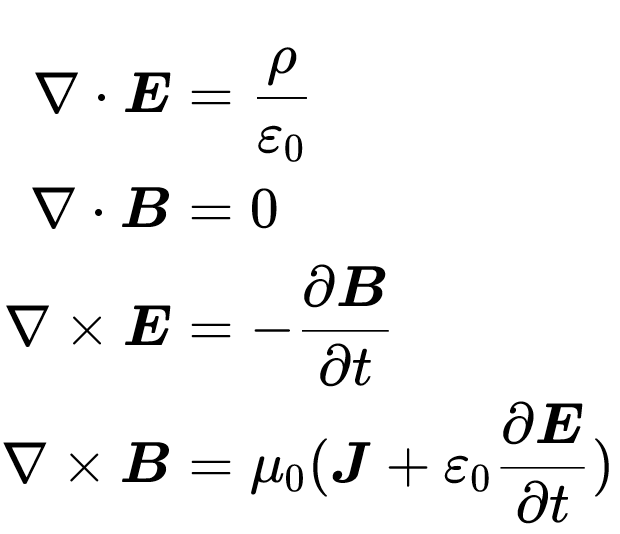
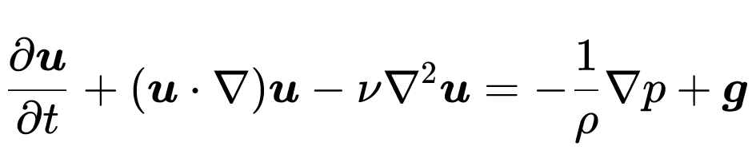
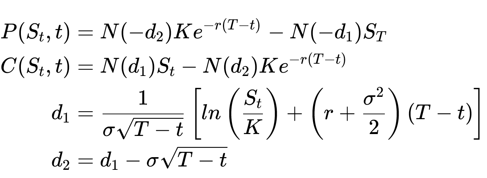

# Math2Pix 

**Covert katex math into any kind of images**

----

- by walkerchi

----

## Example

### [Maxwell](https://en.wikipedia.org/wiki/Maxwell%27s_equations) 

```latex
\begin{aligned}
\nabla \cdot \boldsymbol E &= \frac{\rho}{\varepsilon_0}
\\
\nabla \cdot \boldsymbol B &= 0
\\
\nabla \times \boldsymbol E &= -\frac{\partial \boldsymbol B}{\partial t}
\\
\nabla \times \boldsymbol B &= \mu_0 (\boldsymbol J + \varepsilon_0\frac{\partial \boldsymbol E}{\partial t})
\end{aligned}
```

- $\boldsymbol E$ : Electric Field (vector field)
- $\boldsymbol B$ : Magnetic Field (pseudovector field)
- $\boldsymbol J$ : current density 
- $\rho$ : charge density
- $\varepsilon_0$ : [permittivity of free space](https://en.wikipedia.org/wiki/Vacuum_permittivity)
- $\mu_0$: [permeability of free ](https://en.wikipedia.org/wiki/Vacuum_permeability)


{: style="background-color: 'white'; border-radius: 5"}


### [Navier-Stokes](https://en.wikipedia.org/wiki/Navier%E2%80%93Stokes_equations)

```latex
\begin{aligned}
\frac{\partial \boldsymbol u}{\partial t}+
(\boldsymbol u\cdot \nabla)\boldsymbol u - 
\nu \nabla^2 \boldsymbol u = 
- \frac{1}{\rho}\nabla p + \boldsymbol g
\end{aligned}
```

- $\boldsymbol{ u}$ : flow velocity
- $\rho$ : mass density
- $p$ : pressure
- $\boldsymbol{ g}$: body accerlation on the continuum like gravity




### [Schrödinger equation](https://en.wikipedia.org/wiki/Schr%C3%B6dinger_equation)

```latex
\begin{aligned}
i\hbar\frac{\partial \Psi(x,t)}{\partial t} = 
\left[-\frac{\hbar^2\partial^2}{2m\partial x^2} + V(x,t) \right] \Psi(x,t)
\end{aligned}
```

- $\Psi(x,t)$ : wave function in $\mathbb C$
- $V(x,t)$ : potential 
- $\hbar$ : [plank constant](https://en.wikipedia.org/wiki/Planck_constant)
- $i$ : imaginary unit


### [Black-Scholes](https://en.wikipedia.org/wiki/Black%E2%80%93Scholes_model)

```latex
\begin{aligned}
P(S_t,t) &= N(-d_2)Ke^{-r(T-t)} - N(-d_1)S_T
\\
C(S_t, t) &= N(d_1)S_t - N(d_2)Ke^{-r(T-t)}
\\
d_1 &= \frac{1}{\sigma\sqrt{T-t}}\left[ln\left(\frac{S_t}{K}\right)+\left(r+\frac{\sigma^2}{2}\right)(T-t)\right]
\\
d_2 &= d_1 - \sigma\sqrt{T-t}
\end{aligned}
```
- $P(S_t,t)$ : price of a European put(sell) option
- $C(S_t,t)$ : price of a European call(buy) option
- $N(x)$: gaussian  cumulative distribution function(cdf)
- $T$ : time of option expiration 
- $S_t$ : price of the underlying asset at time $t$
- $r$ :  annualized risk-free interest rate
- $K$ :  strike price(fixed price) of the option
- $\sigma$ : standard deviation of the stock's returns




## TODO

- [ ] add highlight syntax
- [ ] more example

